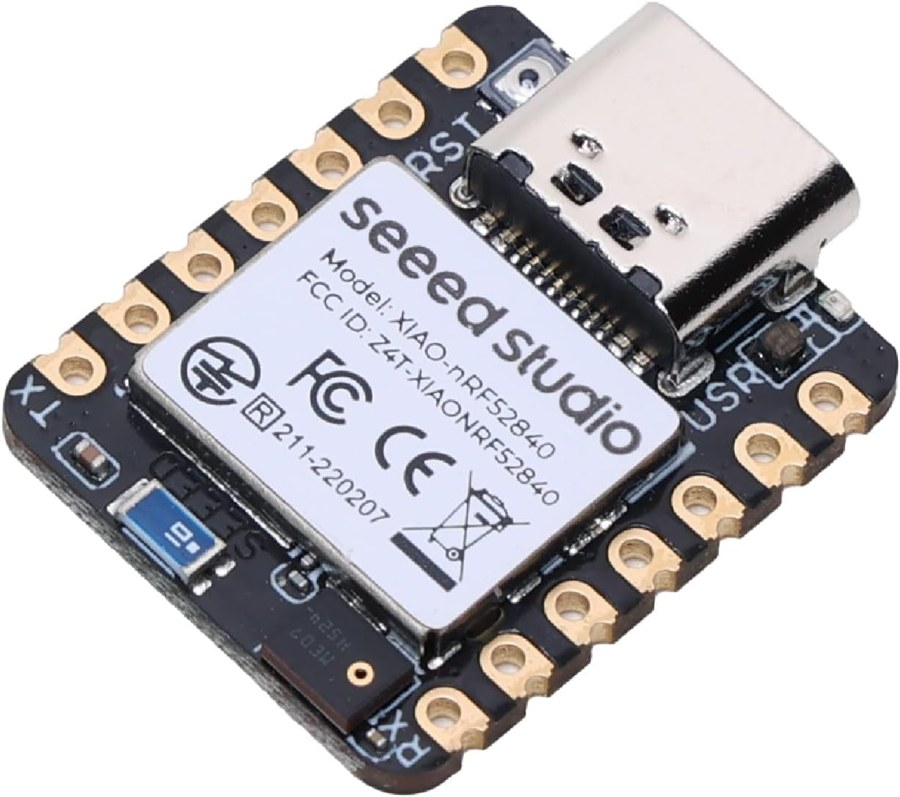
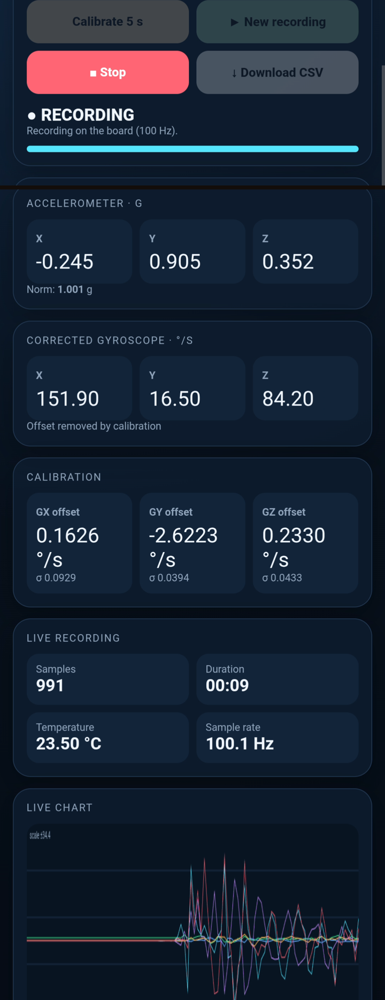

# IMU BLE Logger — Inertial Measurement Unit · Bluetooth Low Energy

[](https://r1py.github.io/IMU-BLE-Logger/web/)

A compact, battery-powered **wireless 6-axis IMU data logger** for measuring motion, vibration, and angular rotation on a vehicle, machine, or other moving object.

Built on the **Seeed XIAO nRF52840 Sense**, it records:

- **3-axis acceleration**
- **3-axis gyroscope data**
- **Temperature**
- **100 Hz sampling rate**

Measurements are stored directly on the device and can be controlled through a **Bluetooth Low Energy (BLE) web dashboard** from a phone or laptop.

The dashboard provides:

- **Sensor calibration**
- **Live data monitoring**
- **Measurement start/stop control**
- **CSV data export**

**No app to install · No cable · No cloud required**

| The board | The dashboard |
|:---:|:---:|
|  |  |

> Board photo: Seeed Studio XIAO nRF52840 Sense product image. Swap `docs/images/board.jpg` for your own photo of the wired-up board if you'd rather avoid using a vendor product shot.

---

## 🚀 Quick start

You need **Arduino IDE**, the firmware from this repository, and **Chrome or Edge** for the dashboard.

### First use: flash the board

1. Install the [Arduino IDE](https://www.arduino.cc/en/software) (2.x recommended).
2. Add the Seeed board index URL in *File → Preferences → Additional boards manager URLs*:
   `https://files.seeedstudio.com/arduino/package_seeeduino_boards_index.json`
3. In *Boards Manager*, install **Seeed nRF52 Boards** (the non-mbed variant).
4. In *Library Manager*, install **Seeed Arduino LSM6DS3**.
5. Select **Seeed XIAO nRF52840 Sense**.
6. Open `firmware/imu_ble_logger/imu_ble_logger.ino`.
7. Connect the XIAO by USB and click **Upload**.
8. Once the upload is complete, disconnect USB if you want to power the board from a battery.

### Make a measurement

1. **Power the board** (USB or battery).
2. **Open the dashboard:** 👉 **<https://r1py.github.io/IMU-BLE-Logger/web/>**
3. Tap **Bluetooth** and select **`IMU-LOGGER`**.
4. Put the board still and tap **Calibrate 5 s**.
5. Tap **New recording**, perform your experiment, then tap **Stop**.
6. Tap **Download CSV**. You get `imu_log_<date>.csv` at 100 Hz.

The dashboard is only the control and visualization interface. The recording itself is stored on the board's RAM, so losing the Bluetooth connection does not interrupt it.

> **Good to know**
> - Works on **Android, Windows, macOS, Linux, ChromeOS** with Chrome or Edge. Not on iPhone/iPad Safari (see [browser compatibility](#browser-compatibility)).
> - Up to **60 s per recording**. The recording is stored on the board, so it survives a phone disconnection, but it is **lost if the board is powered off**. Download before unplugging.
> - The live values only move **while recording**.

**Don't have the firmware on the board yet?** Follow [Installation](#installation): it takes about 10 minutes, once.

---

## Table of contents

- [Quick start](#-quick-start)
- [Features](#features)
- [How it works](#how-it-works)
- [Hardware](#hardware)
- [Installation](#installation)
  - [1. Flash the firmware](#1-flash-the-firmware)
  - [2. Choose how to run the dashboard](#2-choose-how-to-run-the-dashboard)
- [Using the dashboard](#using-the-dashboard)
- [CSV format](#csv-format)
- [Configuration](#configuration)
- [Design decisions](#design-decisions)
- [Limitations](#limitations)
- [Troubleshooting](#troubleshooting)
- [Project structure](#project-structure)
- [Verifying a recording](#verifying-a-recording)
- [Documentation](#documentation)
- [License](#license)

## Features

- **Regular 100 Hz sampling** of a 3-axis accelerometer (±4 g), a 3-axis gyroscope (±500 °/s) and the die temperature. Measured on a real recording: 100.00 Hz average, no gap over 19.7 s.
- **Up to 60 s per recording**, stored on the board. The phone is only a remote control and a viewer: closing the page or losing the Bluetooth link does **not** interrupt or erase a recording.
- **Live view** (10 Hz) of the acceleration and the gyroscope, with a 10 s scrolling chart.
- **Gyroscope calibration**: a 5 s stillness measurement estimates the gyro offset and its standard deviation; both raw and offset-corrected angular rates are exported.
- **Reliable download** of the full-rate recording, with an integrity check (byte count and sample count) that warns you if anything went missing.
- **Zero install for users**: the dashboard is a single static HTML file using the Web Bluetooth API, hosted on GitHub Pages.
- **Self-resynchronizing**: reconnect at any time (even mid-recording) and the dashboard shows the real state of the board.

## How it works

```
┌────────────────────────────┐        BLE         ┌──────────────────────────────┐
│  XIAO nRF52840 Sense       │                    │  Web dashboard (Chrome)      │
│                            │  live  (10 Hz)  ─► │  values + scrolling chart    │
│  LSM6DS3 IMU ─► 100 Hz     │  status/meta    ─► │  state, buttons              │
│  sampling loop             │  ◄─ commands       │  C / S / E / D / M           │
│        │                   │  data (download) ─►│  rebuilds the CSV in-browser │
│        ▼                   │                    └──────────────────────────────┘
│  RAM buffer (18 B/sample,  │
│  60 s = 108 KB)            │
└────────────────────────────┘
```

1. The firmware samples the IMU on a fixed 10 ms schedule and appends each sample to a RAM buffer as an 18-byte binary record.
2. While recording, one sample out of ten is also pushed over BLE for the live display.
3. When you press **Download**, the board streams the whole buffer over a BLE notification characteristic, in chunks sized to the negotiated MTU, with retries when the BLE queue is full.
4. The browser reassembles the stream, checks its size, converts the binary records to physical units, and saves a CSV file.

The BLE protocol (services, packets, commands) is fully documented in [`docs/PROTOCOL.md`](docs/PROTOCOL.md), so you can also write your own client.

## Hardware

| Item | Notes |
|---|---|
| **Seeed XIAO nRF52840 Sense** | The *Sense* variant is required: it embeds the LSM6DS3TR-C IMU (I²C address `0x6A`). |
| USB-C cable | For flashing and power. |
| Battery (optional) | A LiPo on the XIAO battery pads makes it portable. Remember: a recording is lost if the board loses power. |
| Phone or computer with Chrome / Edge | Web Bluetooth is required (see [compatibility](#browser-compatibility)). |

No external wiring is needed.

## Installation

Two things are needed: the **firmware** on the board (once), and a **dashboard** to talk to it. For most people the dashboard is the hosted page, so only step 1 is real work.

### 1. Flash the firmware

1. Install the [Arduino IDE](https://www.arduino.cc/en/software) (2.x recommended).
2. Add the Seeed board index URL in *File → Preferences → Additional boards manager URLs*:
   `https://files.seeedstudio.com/arduino/package_seeeduino_boards_index.json`
3. In *Boards Manager*, install **Seeed nRF52 Boards** (the non-mbed variant, which ships the Adafruit Bluefruit library).
4. In *Library Manager*, install **Seeed Arduino LSM6DS3**.
5. Select the board **Seeed XIAO nRF52840 Sense**.
6. Get the code: `git clone https://github.com/r1py/IMU-BLE-Logger.git` (or *Code → Download ZIP* on GitHub).
7. Open `firmware/imu_ble_logger/imu_ble_logger.ino` and click **Upload**.
8. *(Optional)* Open the Serial Monitor at 115200 baud to see recording and download diagnostics.

> The sketch was written against the Bluefruit API shipped with the Seeed nRF52 core (`Bluefruit.Periph.setConnectCallback`, `Bluefruit.Connection(handle)->getMtu()`, ...). If a future core renames these calls, check the headers in the installed core (`libraries/Bluefruit/src/`) rather than the online Adafruit documentation, which may describe a newer version.

### 2. Choose how to run the dashboard

Web Bluetooth only works in a **secure context**: `https://` or `http://localhost`. Four ways, from simplest to most flexible:

#### Option A: the hosted dashboard (recommended)

Open **<https://r1py.github.io/IMU-BLE-Logger/web/>**. Nothing else to do.

This page is served over HTTPS by GitHub Pages straight from this repository, so it always matches the latest `main` branch. The version number is shown in the page footer.

> It looks for a device named exactly `IMU-LOGGER`. If you changed `DEVICE_NAME` in the firmware, or modified the protocol, use option B or C with your own copy of the page.

#### Option B: your own copy on GitHub Pages (fork)

Use this to customize the dashboard, change the device name, or keep a stable version.

1. **Fork** this repository on GitHub.
2. In your fork: *Settings → Pages → Build and deployment → Source: **Deploy from a branch***, then choose branch **`main`** and folder **`/ (root)`**, and save.
3. After a minute, your dashboard is at `https://<your-user>.github.io/<your-repo>/web/`.

Any commit you push to `main` is redeployed automatically. (GitHub Pages is free for public repositories.)

#### Option C: local server on a computer

From the repository root:

```console
python3 -m http.server 8000
```

Then open `http://localhost:8000/web/` in Chrome or Edge on the same computer. `localhost` counts as a secure context, so Web Bluetooth works without HTTPS.

#### Option D: local server with a phone

Run option C on your computer, connect the phone by USB with USB debugging enabled, open `chrome://inspect/#devices` on the computer, add the port `8000` under *Port forwarding*, then open `http://localhost:8000/web/` in Chrome **on the phone**.

> Do not open `index.html` by double-clicking it (`file://`): Chrome blocks Web Bluetooth there.

## Using the dashboard

| Control | What it does |
|---|---|
| **Bluetooth** | Connects to the board. The pill at the top right shows the connection state. |
| **Calibrate 5 s** | Keeps the board still for 5 s and computes the gyroscope offset. Optional but recommended before each session, and after the board has warmed up. |
| **New recording** | Starts a recording. **The previous recording is discarded.** |
| **Stop** | Ends the recording and keeps it on the board. It also stops automatically at 60 s. |
| **Download CSV** | Transfers the recording and saves it as `imu_log_YYYY-MM-DD_HH-MM.csv`. |

Panels:

- **Accelerometer / corrected gyroscope**: latest live values (10 Hz).
- **Calibration**: last gyro offsets and their standard deviation. A large deviation means the board moved during calibration.
- **Live recording**: sample count, duration, temperature, and the effective sample rate computed from the board's own timestamps (≈ 100 Hz).
- **Live chart**: last 10 s of the three accelerations (g) and the three gyro rates (scaled by 1/20 to share the axis).
- **Recording on the board**: status (`Empty` / `Recording` / `Available`), sample count and duration of the stored recording.

## CSV format

One header line, then one line per sample. UTF-8 with BOM (opens directly in Excel).

| Column | Unit | Description |
|---|---|---|
| `sequence` | – | Sample index, starting at 0 with no gaps. |
| `timestamp_us` | µs | Board `micros()` timestamp (see the note below). |
| `temperature_C` | °C | IMU die temperature. |
| `ax_g`, `ay_g`, `az_g` | g | Acceleration on each axis. |
| `gx_raw_dps`, `gy_raw_dps`, `gz_raw_dps` | °/s | Angular rate as measured. |
| `gx_corrected_dps`, `gy_corrected_dps`, `gz_corrected_dps` | °/s | Angular rate minus the calibration offset. Equal to the raw value if you did not calibrate (offset 0). |

Example (see [`examples/sample_recording.csv`](examples/sample_recording.csv), a real 19.7 s recording):

```csv
sequence,timestamp_us,temperature_C,ax_g,ay_g,az_g,gx_raw_dps,gy_raw_dps,gz_raw_dps,gx_corrected_dps,gy_corrected_dps,gz_corrected_dps
0,357470703,22.98,-0.04325,0.78338,-0.57988,0.391,-2.656,0.234,0.035,-0.009,0.046
1,357480468,22.98,-0.04312,0.78350,-0.58075,0.328,-2.641,0.156,-0.027,0.007,-0.0
```

**About timestamps.** On the nRF52840 Arduino core, `micros()` has a resolution of about 0.977 ms, so individual `timestamp_us` values are quantized (intervals between consecutive samples are 8.79, 9.77, 10.74 or 11.72 ms). The average is exact. For FFT or integration, use `sequence / 100` as the time axis rather than the raw timestamps.

**Resolution.** Records are stored as 16-bit integers: acceleration at 0.125 mg, angular rate at 0.0156 °/s, close to the sensor's own resolution.

## Configuration

Compile-time settings at the top of `imu_ble_logger.ino`:

| Constant | Default | Meaning |
|---|---|---|
| `DEVICE_NAME` | `IMU-LOGGER` | BLE name. The dashboard filters on it (`DEVICE_NAME` in `web/index.html`), so change both, and use your own copy of the page ([option B or C](#2-choose-how-to-run-the-dashboard)). |
| `MAX_SAMPLES` | `6000` | Buffer size: 6000 samples = 60 s at 100 Hz = 108 KB of RAM. The nRF52840 has 256 KB; raise it gradually and watch the compiler's RAM report. The dashboard capacity text says "60 s", update it too. |
| `LIVE_DIVIDER` | `10` | One live packet per N samples (10 → 10 Hz). Lowering it increases BLE load and can disturb sampling. |
| `SAMPLE_PERIOD_US` | `10000` | Sampling period (100 Hz). If you change it, also update `SAMPLE_RATE` in `web/index.html`. |
| `CALIBRATION_SAMPLES` | `500` | Calibration length (5 s at 100 Hz). |
| `WANTED_MTU` | `247` | ATT MTU requested from the phone. |
| `imu.settings.*` | ±4 g, ±500 °/s | Sensor ranges. If you change a range, update the scale factors in `Record` (see `quantize` calls) and in `web/index.html`. |

## Design decisions

This section explains the non-obvious choices, and the bugs that led to them. They were all found on real hardware.

### Why RAM instead of the internal flash?

The first version wrote a CSV text file to the internal flash (LittleFS). Two real recordings revealed two problems:

| Problem | Evidence |
|---|---|
| **The filesystem is tiny.** | Both downloaded files stopped at ~25 KB (25 394 and 24 304 bytes), whatever the recording length, while the board's own counter said 88 683 / 53 726 bytes. The serial log confirmed the BLE transfer was complete (`sent=24304/24304`): the *file* was short. Writes failed silently once the ~28 KB partition was full. |
| **Flash writes stall the loop.** | The same two files had an effective rate of **19.3 Hz and 21 Hz** instead of 100 Hz, with gaps up to 580 ms (flash erase cycles block the CPU). |

Storing 18-byte binary records in RAM fixed both: 60 s fit in 108 KB, and the sampling loop no longer touches flash. The next recording measured **100.00 Hz with no gap** ([`tools/check_sampling.py`](tools/check_sampling.py) output in [Verifying a recording](#verifying-a-recording)).

The trade-off is volatility: RAM is lost on power-off. It does survive phone disconnections, which was the important property of the original design (the browser is never the storage).

### Why negotiate a larger MTU?

A BLE connection starts with ATT MTU 23, i.e. **20 usable bytes** per notification. The live packet is 28 bytes, the calibration packet 24 bytes and the download chunks up to 180 bytes, so without a larger MTU they cannot be sent as-is (on nRF52 / Bluefruit, notifications longer than the MTU allows are dropped or truncated). The firmware now requests MTU 247 and a longer data length on every connection, and sizes download chunks from the MTU actually negotiated, with a safe 20-byte fallback.

### Why retry every notification?

`notify()` returns `false` when the BLE stack's queue is full and the data is **lost** unless the caller retries. Every notification (status, metadata, calibration, download chunks) goes through `notifyReliable()`, which retries with a short delay and gives up cleanly if the link drops.

### Why push the state when a client subscribes?

Right after boot nobody is connected, so a one-shot status message would be lost. The firmware instead sends the current status, metadata, and calibration whenever a client enables the corresponding notifications. A dashboard that reconnects (or reloads) mid-recording is therefore in sync without asking.

### Why is the live stream only 10 Hz?

The early versions pushed a live packet for every sample, and the recordings showed samples arriving in bursts with long gaps. That version also wrote to flash, so the two effects were not separated; decimating the live stream to 10 Hz is a precaution that keeps the BLE stack from ever competing with the sampling loop, and 10 Hz is plenty for a display. The full-rate data comes from the download.

### Why is the CSV built in the browser?

Binary records are 4.7× smaller than CSV text (18 vs ~84 bytes per sample), which is what makes 60 s fit in RAM and keeps the BLE download short. The conversion to physical units is trivial in JavaScript.

## Limitations

- **Recordings are lost on power-off or reset** (RAM storage). Download before unplugging.
- **60 s maximum** per recording with the default buffer.
- **One BLE connection at a time.**
- **Timestamp resolution is ~1 ms** (see [CSV format](#csv-format)); the sample *count* is exact.
- The IMU output rate is 104 Hz while the loop reads at 100 Hz, so about one sensor sample in 25 is never read. This has no visible effect on vibration analysis, but it is not aliasing-free resampling. Setting the sensor to 208 Hz would always give the freshest sample.
- The gyroscope offset is computed once per calibration; it drifts with temperature. Recalibrate after warm-up for precise angular-rate work.
- Not for safety-critical use; the sensor is a consumer MEMS part.

### Ideas for extending it

- **Persistent / longer recordings**: the XIAO nRF52840 Sense has a 2 MB QSPI flash chip. Using it requires a QSPI driver beyond what the Seeed core exposes through Arduino, so it was not attempted here. An SD card breakout is another option.
- Sensor rate of 208 Hz with 2:1 decimation, or 416 Hz+ sampling to a smaller buffer.
- Adding the LSM6DS3's onboard FIFO to remove polling jitter.
- A native or Python (`bleak`) client using [`docs/PROTOCOL.md`](docs/PROTOCOL.md).

## Troubleshooting

| Symptom | Likely cause and fix |
|---|---|
| **The device does not appear in the Bluetooth picker.** | The name must be exactly `IMU-LOGGER` and the service UUID advertised. Check the firmware is running (Serial Monitor) and that no other device is already connected to the board. |
| **"Web Bluetooth is not available".** | Use Chrome/Edge (Android, Windows, macOS, Linux, ChromeOS) over `https://` or `localhost`. iOS browsers do not support Web Bluetooth. |
| **Dashboard values stay empty.** | Live packets are only sent **while recording**. Press *New recording*. If they still do not update, the MTU may not have been negotiated: update the Seeed core and the browser. |
| **"CSV incomplete" warning.** | The received byte count differs from the board's. Download again (the recording is still on the board). Open the Serial Monitor: a `[DL] aborted` line gives the reason. |
| **The downloaded `.csv` looks like binary garbage (starts with `IMU1`).** | The page you opened is an old, cached version that does not convert the binary stream. Hard-refresh the page (or clear the site data) and check the version in the footer. |
| **The page seems outdated after an update.** | Browsers cache pages. Reload without cache (Ctrl+Shift+R, or clear the site data on Android). The footer shows the running version. |
| **The connection pill says "Disconnected" but the board is running.** | Reload the page and reconnect. The recording on the board is unaffected. |
| **`IMU_ERROR` status.** | The LSM6DS3 was not found at `0x6A`. Make sure you have the **Sense** variant. |
| **Compile error: `Bluefruit.Gap` / `setConnectCallback` not found.** | You are using a different core than the Seeed nRF52 one. Use *Seeed nRF52 Boards*, or adapt the callback registration to your core's Bluefruit version. |
| **Compile error mentioning `logf`.** | Do not name a global variable `logf`: it clashes with the C math function. (The current sketch does not use that name.) |
| **Effective rate is not 100 Hz.** | Run [`tools/check_sampling.py`](tools/check_sampling.py) on the CSV. Gaps usually mean the BLE link is saturated or `LIVE_DIVIDER` was lowered too much. |

### Browser compatibility

| Platform | Chrome / Edge | Safari / Firefox |
|---|---|---|
| Android | ✅ | ❌ |
| Windows / macOS / Linux / ChromeOS | ✅ | ❌ |
| iOS / iPadOS | ❌ (all browsers use WebKit; the third-party *Bluefy* browser adds Web Bluetooth) | ❌ |

## Project structure

```
IMU-BLE-Logger/
├── firmware/
│   └── imu_ble_logger/
│       └── imu_ble_logger.ino   # Arduino sketch for the XIAO nRF52840 Sense
├── web/
│   └── index.html               # Single-file Web Bluetooth dashboard (hosted on GitHub Pages)
├── docs/
│   ├── PROTOCOL.md              # BLE services, packets, commands, download format
│   └── images/
│       ├── board.jpg            # Photo of the board (README)
│       └── dashboard.png        # Screenshot of the dashboard (README)
├── tools/
│   └── check_sampling.py        # Sampling-rate / gap analysis of an exported CSV
├── examples/
│   └── sample_recording.csv     # A real 19.7 s recording
├── LICENSE
└── README.md
```

## Verifying a recording

Run the checker on any exported CSV:

```console
$ python3 tools/check_sampling.py examples/sample_recording.csv
File               : examples/sample_recording.csv
Samples            : 1975
Sequence contiguous: True
Duration           : 19.739 s
Effective rate     : 100.00 Hz (nominal 100 Hz)
Interval (us)      : min 8789  median 9766  mean 10000  max 11719  stdev 510
Gaps > 1.5 periods : 0
```

The four interval values in the histogram (8789 / 9766 / 10742 / 11719 µs) are multiples of the 0.977 ms clock tick, not real jitter of the sampling schedule.

## Documentation

- [`docs/PROTOCOL.md`](docs/PROTOCOL.md): the complete BLE protocol and the binary download format.

## License

[MIT](LICENSE).
